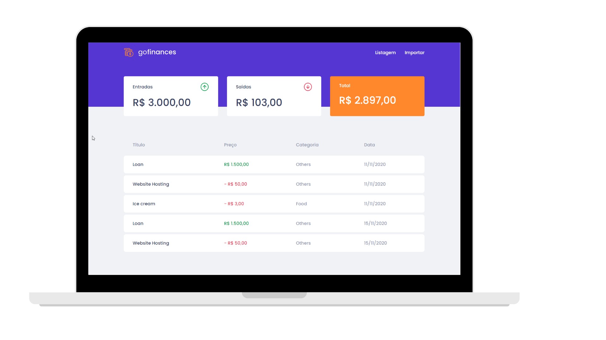

<div align="center">

<p align="center">
  
<p>

<p align="center">
  
  
</p>

**GoFinances** is a simple project of transaction management, where you can visualize your balance account and the movimation of the transactions.


<p align="center">
  
<p>

</div>

### Features

- Possibility to include different types of transactions and check out the incomes, outcomes, and balance.
- Allow the import of a CSV file to generate new records in the database.

### Summary

- [Technology](#rocket-technology)
  - [Application](#computer-web)
- [How to run](#boom-how-to-run)
  - [Backend](#hammer-backend)
  - [Web](#computer-web-1)


### :rocket: Technology

<div align="center">


</div>


### :computer: Application

The application was developed with [Typescript](https://www.typescriptlang.org/) using the framework [ReactJS](https://reactjs.org/) and [Styled-Components](https://styled-components.com/) for visual proposes.

The backend is using Multer and CSV Parse to upload the CSV file and insert new records in the database.

---

# :boom: How to run

- ### **Prerequisites**

  - It's **necessary** to have **[Node.js](https://nodejs.org/en/)** installed on the computer
  - It's **necessary** to have **[Git](https://git-scm.com/)** installed and configured on the computer
  - Also, it's **necessary** to have a package manager either **[NPM](https://www.npmjs.com/)** or **[Yarn](https://yarnpkg.com/)**.
  - Finally, it is essential to have Docker installed to run database Postgres.


Creating database Postgres:

```sh
  $ docker run --name gofinances -e POSTGRES_PASSWORD=docker -p 5432:5432 -d postgres
``` 


Clone the repository:

```sh
  $ git clone https://github.com/paulo-carvalho93/gofinances.git
```


### :hammer: Backend

```sh
  # API
  $ cd gofinances/backend
  # Installing project dependencies.
  $ yarn # or npm install

  # Start Web Project
  $ yarn dev:server # or npm dev:server

```


### :computer: Web

```sh
  # API
  $ cd gofinances/web
  # Installing project dependencies.
  $ yarn # or npm install

  # Start Web Project
  $ yarn start # or npm start
```


## POST - IMPORT CSV http://localhost:3333/transactions/import
```sh

You can find the file inside the test folder at Backend. (import_template.csv)

```

## POST - http://localhost:3333/transactions
```sh
    {
      "title": "House",
      "value": 140000,
      "type": "outcome",
			"category": "Properties"
    },
    {
      "title": "Lottery",
      "value": 2000000,
      "type": "income",
			"category": "Lucky"
    }

```

## GET - http://localhost:3333/transactions
```sh
{
  "transactions": [
    {
      "id": "62500601-fa5f-4359-8358-bb884566ce8d",
      "title": "Loan",
      "type": "income",
      "value": "1500.00",
      "category_id": "6d205f93-6d38-4228-bc8f-ac6292639f91",
      "created_at": "2020-11-12T02:29:21.346Z",
      "updated_at": "2020-11-12T02:29:21.346Z"
    },
    {
      "id": "4c06b395-4ffe-416e-88ef-4070774290f1",
      "title": "Website Hosting",
      "type": "outcome",
      "value": "50.00",
      "category_id": "6d205f93-6d38-4228-bc8f-ac6292639f91",
      "created_at": "2020-11-12T02:29:21.346Z",
      "updated_at": "2020-11-12T02:29:21.346Z"
    },
    {
      "id": "0850d442-359d-468c-93a8-b34faad13d5a",
      "title": "Ice cream",
      "type": "outcome",
      "value": "3.00",
      "category_id": "6cffd494-2bfa-4318-ab11-056a0c34a765",
      "created_at": "2020-11-12T02:29:21.346Z",
      "updated_at": "2020-11-12T02:29:21.346Z"
    }
  ],
  "balance": {
    "income": 1500,
    "outcome": 53,
    "total": 1447
  }
}
```

## DELETE - http://localhost:3333/transactions/{ID-TRANSACTION}
